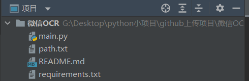
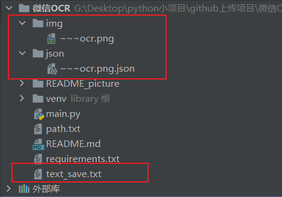
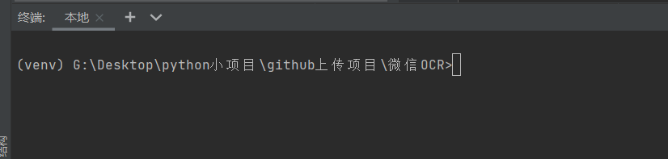
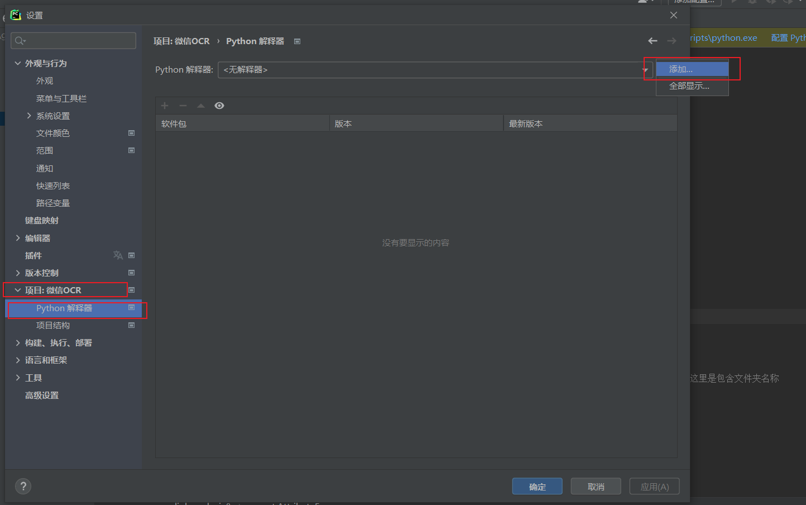
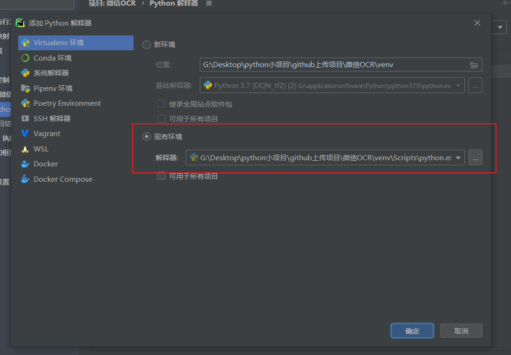
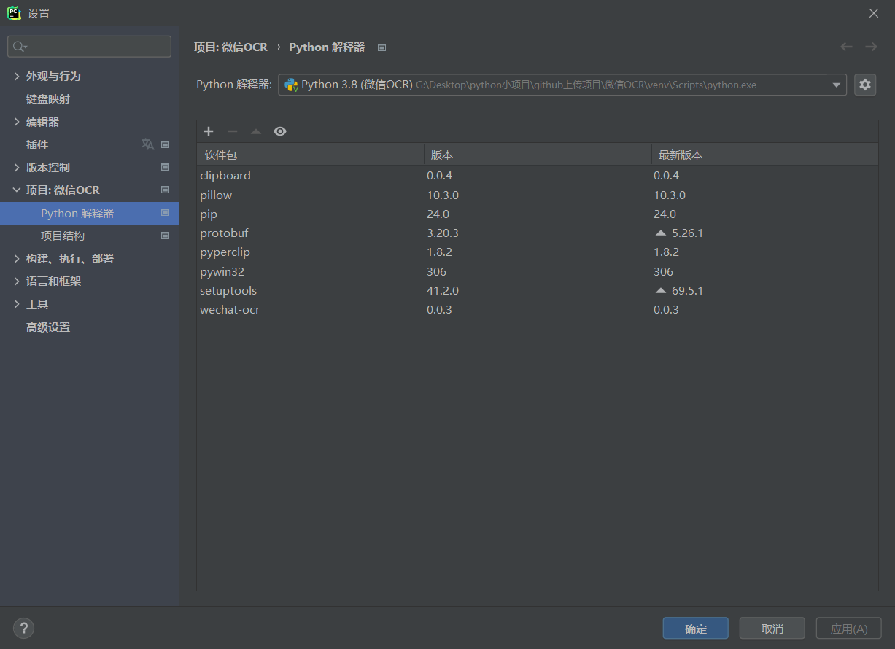
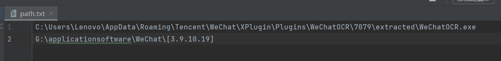
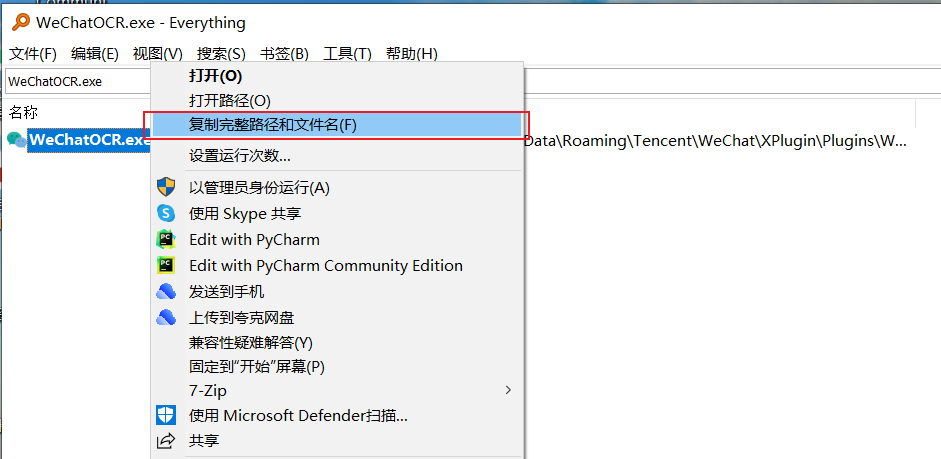
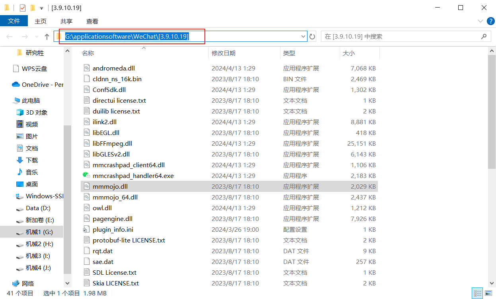

# 最新更新
- 20240712

本次更新增加了识别`path.txt`中第二行目录是否存在，如果不存在，说明微信更新了，则去寻找目前存在的目录，并进行更新。这样好处就是，你只需要配置一次，后续微信更新，代码会自动更新。
- 20240626

如果你的微信更新过，你需要在path.txt中将微信版本进行更改，否则软件运行会闪退。例如： G:\applicationsoftware\WeChat[3.9.10.19] 更改为G:\applicationsoftware\WeChat[3.9.11.17]

# 前言
## 项目功能
- 通过截图软件进行截图后，通过按下`Ctrl+C`后，实现了图片提取文字，并将文字复制到剪切板中，大家通过`Ctrl+V`即可粘贴。
## 项目优势
- 实现了图片提取文字，并且依托微信OCR，其识别精度还是挺高的；
- 无需登录微信，即可实现微信OCR；
- 操作简单，项目集成了使用微信OCR进行提取文字进行粘贴的一些步骤，使得你只需要通过`Ctrl`+`C`和`V`键，即可快捷实现复制图片中的文字。
- 可以通过更改项目中的`mode`参数，实现文字**分行复制**还是**同行复制**。
## 项目展示

## 初始项目架构
下载项目打开后，项目架构如下：



其中

`mian.py`是项目代码。

`path.txt`是配置微信OCR所需要的路径存放处。

`README.md`是项目说明文档。

`requirements.txt`是项目所需的包及版本。

`README_picture`存放的是`README.md`项目说明文档所需要的图片。

## 运行后的项目架构
项目成功运行后，会生成`img`文件夹，里面存放的是剪切板中存放的图片，`json`文件夹中存放的是剪切板图片经过微信OCR识别后保存的json文件。
并且会生成一个`text_save.txt`文件，里面的内容就是图片提取的文字。如下图所示：




---

# 配置环境
要想运行本项目，首先你得先配置项目环境。
## 创建虚拟环境
首先打开终端，输入以下命令，创建虚拟环境
```shell
python -m venv venv
```
然后进入到这个虚拟环境，并将其激活
```shell
venv\scripts\activate
```
注意这里是反斜杠。

此时可以看到，命令前面有个(venv)，说明已经进入了这个虚拟环境了。


## 安装项目包
如果你的pip版本不够，可以升级一下。命令如下
```shell
python -m pip install --upgrade pip
```
然后使用下面的命令，安装requirements.txt中的包
```shell
pip install -r requirements.txt
```
---
## 配置python解释器
这时候需要配置一下python解释器。当然这一步你可以选择在创建完虚拟环境后就进行这一步操作。

点击现有环境，一般来说，它会自动帮你选择你刚刚配置好的`venv`中的`python.exe`解释器，如果没有的话，自己选择一下。

点击确定

可以看到，虚拟环境中已经安装了你需要的包了。

以上操作完成后，你项目基础配置就完成了。
## 配置微信OCR和mmmojo.dll路径
找到项目中的`path.txt`文件，里面存放的是你WeChatOCR.exe和mmmojo.dll的路径

> C:\Users\Lenovo\AppData\Roaming\Tencent\WeChat\XPlugin\Plugins\WeChatOCR\7079\extracted\WeChatOCR.exe

> 你可以使用everything软件进行查找，并复制完整路径及文件名。

> G:\applicationsoftware\WeChat\[3.9.10.19]

> 同理，你可以复制mmmojo.dll所在的路径。

**这里需要注意的是：WeChatOCR.exe的路径需要到最终文件名，mmmojo.dll的路径只需要到上一级目录即可。**

然后将这两个路径，依次分行复制到`path.txt`中，保存。

以上这一步操作需要好好配置，否则后续就无法运行。
# 运行代码
接下来就可以运行代码了

# 实现同行的复制
在main.py中的第135行中，你可以将mode改成2，这样就能将识别结果的文字放在同一行，适用与同一段落的图片的截图并提取文字。
```python
# TODO 你可以将mode改成2，实现文字放在同一行。
save_text(json_file, save_file, mode=2)
```
# 最后
经过以上的讲解，我觉得大家对于这个项目的配置已经运行应该是没有问题了。

如有问题，欢迎＋v：TheOnewbd和我交流。

**希望大家可以多多关注一下我的公众号，对这个项目的免费讲解，我会更新在微信公众号中，绝对不会让你失望。**


